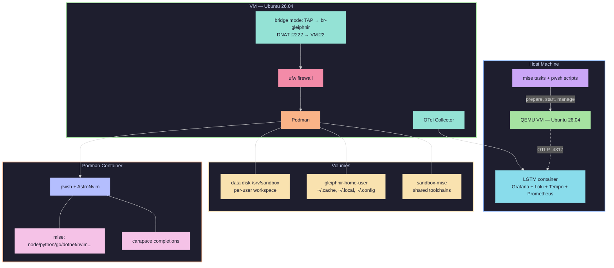

# Gleiphnir

Open-source alternative to [Docker Sandbox](https://www.docker.com/products/docker-sandbox) built only with open-source components: **QEMU + Ubuntu 26.04 + ufw + Podman + mise + pwsh**.

Each developer SSHes into an Ubuntu VM and lands directly in an **ephemeral, read-only Podman container** whose default shell is **pwsh** (bash still available). The container has no `sudo`, `--cap-drop ALL`, a read-only rootfs, and mounts three volumes: the persistent workspace, a per-user persistent home, and a **shared mise volume** so toolchains download once for everyone.

Host-side orchestration is pure **PowerShell (`pwsh`)** driven by **mise tasks** — identical commands work on Linux and Windows.

## TL;DR

**Gleiphnir** gives each developer an isolated, ephemeral Linux sandbox (Podman container inside a QEMU VM) accessible via SSH. Ships with pwsh, neovim, git, dotnet, node, python, go, and more — all managed by mise. Toolchains download once and are shared across users.

| Platform | Local dev | Server / remote access |
|----------|-----------|----------------------|
| **Linux** | [`docs/linux-local.md`](docs/linux-local.md) | [`docs/linux-server.md`](docs/linux-server.md) |
| **Windows** | [`docs/windows-local.md`](docs/windows-local.md) | [`docs/windows-server.md`](docs/windows-server.md) |

**Fastest start (Linux):**

```bash
curl https://mise.run | sh && mise install
mise run up
mise run user:add USER=alice KEY=~/.ssh/id_ed25519.pub
ssh -p 2222 alice@127.0.0.1
mise run down
```

**Fastest start (Windows):**

```powershell
mise run up
ssh -p 2222 admin@127.0.0.1
```

## Architecture



## Prerequisites

- **pwsh 7+** ([PowerShell](https://learn.microsoft.com/powershell/) — `snap install powershell --classic` / `winget install Microsoft.PowerShell`)
- **mise** (`curl https://mise.run | sh`) — task runner; `mise install` at repo root
- Linux hosts: `qemu-system-x86_64`, `qemu-img`, plus *one* of cloud-localds / genisoimage / `pip install pycdlib`; bridge mode additionally needs `ip`, `iptables`. See [`docs/linux-local.md`](docs/linux-local.md) for local setup or [`docs/linux-server.md`](docs/linux-server.md) for remote server mode.
- Windows hosts: [QEMU for Windows](https://qemu.weilnetz.de/) on PATH, OpenSSH client, git, python3 (+ `pip install pycdlib`). Enable *Virtual Machine Platform* for WHPX acceleration, or set `QEMU_ACCEL=tcg`. See [`docs/windows-local.md`](docs/windows-local.md) for local setup or [`docs/windows-server.md`](docs/windows-server.md) for remote server mode.

```bash
mise run deps   # verifies your platform's toolchain
```

## Quickstart

```powershell
# 1. See tasks / check deps  (gleiphnir wraps mise)
mise run            # lists all tasks
gleiphnir deps      # gle → gleiphnir short alias
# or: mise run deps

# 2. Full bring-up (downloads image, prepares disks+seed ISO, starts VM, waits for SSH)
gleiphnir up        # or: mise run up

# 3. Watch boot if needed
gleiphnir vm console   # or: gle vm info / mise run vm:console

# 4. SSH as admin
gleiphnir vm ssh

# 5. Create a sandbox user (host side, proxies to VM over SSH)
gleiphnir user add USER=alice KEY=~/.ssh/id_ed25519.pub
# or: mise run user:add USER=alice KEY=~/.ssh/id_ed25519.pub

# 6. Log in as sandbox user — you land straight in the container (pwsh):
ssh alice@192.168.100.10           # or: ssh -p 2222 alice@<host-ip>

# Inside the container (fenrir → fen short alias, uses gdu/yazi):
$PSVersionTable.PSEdition          # Core
fenrir tools list                  # or: fen tools list
fenrir tools volumes               # gdu
fenrir browse /work                # yazi (yasi)
nvim .                             # AstroNvim, EDITOR=nvim pre-wired
git diff                           # paged through delta
hunk diff                          # review-first diff viewer
leaf README.md                     # markdown reader
mise use node@22                   # extra tools install into shared cache

# 7. Policy (egress/ingress) — via fenrir/gleiphnir policy (sbx parity)
gleiphnir policy init balanced      # first run prompts: open/balanced/locked (default balanced)
gleiphnir policy ls --wide
gleiphnir policy allow network registry.npmjs.org
gleiphnir policy allow network api.exa.ai   # exa.ai websearch (https://exa.ai/)
gleiphnir policy check network https://api.github.com:443
# Legacy ufw fw still works (compat):
fenrir firewall allow 203.0.113.42
gleiphnir fw allow IP=203.0.113.42  # let your IP reach SSH (compat)
gleiphnir fw list
gleiphnir fw enforce                # drop bootstrap rule → strict allow-list only

# 8. Tear down
gleiphnir down                      # vm:stop + network:down
```

## Configuration

All tunables live in `config/sandbox.env` (loaded by mise `[env]` + `lib.ps1`). Highlights:

| Variable | Default | Notes |
|---|---|---|
| `NETWORK_MODE` | `bridge` | `bridge` = private bridge + DNAT (**Linux only**) · `user` = QEMU NAT, zero host changes (forced on Windows) |
| `PHYS_IF` | *(empty)* | Enslave a real NIC for a true LAN bridge (wired only) |
| `HOST_SSH_FORWARD_PORT` | `2222` | Host forward to VM sshd |
| `UBUNTU_RELEASE` | `resolute` | Ubuntu 26.04 LTS |
| `QEMU_ACCEL` | `auto` | `kvm` (Linux) / `whpx` (Windows) / `tcg` |
| `QEMU_MONITOR_PORT` | `4444` | Monitor TCP port on Windows hosts (unix socket on Linux) |
| `VM_CPUS` / `VM_RAM_MB` | `4` / `4096` | |

## Policy (egress/ingress) + Firewall (ufw)

Guest owns all policy — host untouched. Presets: `open` (**), `balanced` (deny + curated allowlist `vm/guest/policy-presets/balanced.txt`: npm, pypi, crates, go, nuget, maven, apt, mise, docker, github, vscode, blob, exa.ai/api.exa.ai …), `locked` (deny all). Provision opens `tcp/22` to *any* (bootstrap) + init `balanced`.

```powershell
gleiphnir policy init balanced     # like sbx policy init balanced (prompts on first run)
gleiphnir policy ls --wide         # see preset + global allow/deny
gleiphnir policy allow network registry.npmjs.org   # domain → proxy allowlist
gleiphnir policy allow network "*.exa.ai"            # exa.ai websearch
gleiphnir policy allow network api.exa.ai --sandbox alice  # per-sandbox
gleiphnir policy check network https://evil.com:443  # Allowed/Denied
gleiphnir policy deny network evil.com
gleiphnir policy rm network --resource evil.com
gleiphnir fw allow IP=<your-ip>    # IP/CIDR → ufw (compat, deprecated → policy allow network CIDR)
gleiphnir fw enforce               # remove bootstrap 22/any → strict
# mise run policy:allow network … still works (gle wraps mise)
```

Docs: `docs/policy.md` (global one-short, git-style) + breakout `docs/policy/*.md` per subcommand, `docs/tools-search.md` for `gle tools search`.
Domains matched with `*.host` / `**`; deny wins. Proxy (`mitmproxy` `8080`) enforces domains; `ufw` enforces CIDR + egress default (`allow` in `open`, `deny` + `allow out 53,80,443` in `balanced/locked`). In `user` NAT mode, per-IP ingress is limited (bridge preserves IPs).

## Container & mise

- **Base**: `ubuntu:26.04` + git/curl/etc.; `sudo` removed.
- **Default shell**: pwsh via `/usr/local/bin/sandbox-pwsh` (a bash launcher that resolves the mise-installed pwsh from the shared volume; falls back to bash until first install).
- **Shared tools volume** (`sandbox-mise` → `/opt/mise-shared`): warmed automatically after image build — common toolchains download **once** for all users. Extra `mise use ...` installs land there too and are instantly available to everyone.
- **Per-user home volume** (`gleiphnir-home-<user>`): `~/.cache`, `~/.local` (atuin history!), `~/.config` persist across restarts.
- **Dotfiles via mise**: bashrc / pwsh profile / gitconfig ship at `/etc/sandbox/dotfiles` and are linked by the `dotfiles` mise task on each start. Personal overrides: put same-named files in `/work/dotfiles/`.
- **Editor/diff stack**: nvim + AstroNvim (seeded per workspace), delta as git pager, hunk aliases (`git hdiff`/`git hshow`), leaf markdown reader, yazi/yasi file manager, gdu disk analyzer, fzf/fd/rg, carapace completions, atuin history, opencode agent, dotnet/node/python/go.
- **Shell completion**: Carapace provides nested tab completion for **Fenrir** (`fenrir`/`fen`, in-container → `gdu`/`yazi`, spec `container/files/carapace/specs/fenrir.yaml` → `/etc/carapace/specs`) and **Gleiphnir** (`gleiphnir`/`gle`, host → `mise run …`, **host-only** spec `vm/files/carapace/specs/gleiphnir.yaml` → `~/.config/carapace/specs/` via `vm/scripts/` + shim `~/.config/carapace/bin/gleiphnir` via `run:`). Gleiphnir spec is executable (`run: "[mise, run, ...]"`); Fenrir remains completion-only. See `docs/commands.md` and `docs/policy.md` (host spec: `vm/...` not `container/...`).
- **OTel tracing**: host-side pwsh scripts emit OpenTelemetry spans via `otel-cli` (installed via mise) — visible in Grafana Tempo when observability is enabled.

## Sandbox users & workspaces

- Login shell is `sandbox-shell`: spawns the podman container with the three-volume layout above (`--userns keep-id`, rootful fallback).
- Workspace `/srv/sandbox/<user>` on the dedicated data disk; seeded README on first login.
- Admin management (host via `gleiphnir`, or in-container via `fenrir`):
  ```powershell
  gleiphnir user add USER=carol KEY=/tmp/carol.pub
  gleiphnir user list
  gleiphnir user remove USER=carol   # also removes her home volume
  # inside container: fenrir user add carol --key-file /tmp/carol.pub
  ```

## Task reference (mise) + Gleiphnir (`gle`) / Fenrir (`fen`)

Host orchestration has two equivalent entrypoints: `mise run <task>` and the nested
Carapace-completable `gleiphnir` (`gle`) which **calls `mise run`** under the hood.
Inside containers use `fenrir` (`fen`) which delegates to `gdu`/`yazi`. See `docs/commands.md`.

```
# Host — gleiphnir (gle) wraps mise run
gleiphnir deps             # or: mise run deps
gleiphnir image download / image info
gleiphnir network up / down / status
gleiphnir vm prepare / start / stop / kill
gleiphnir vm console / vm ssh / vm ssh:wait / vm info
gleiphnir vm clean [-All]
gleiphnir user add|remove|list            # gle user add USER=alice KEY=...
gleiphnir fw allow|deny|remove|list|enforce
gleiphnir container build / container info
gleiphnir sbom container|tools|vm|all
gleiphnir tools list|info|clean|clean:all|volumes
gleiphnir obs start|stop|status|open|deploy|clean
gleiphnir secrets init|encrypt|decrypt|sync|list|status
gleiphnir smoke
gleiphnir up / down

# In-container — fenrir (fen) via gdu/yazi
fenrir tools list / info / clean / clean:all / volumes (gdu) / browse (yazi)
fenrir user add|remove|list
fenrir secrets list|set|remove|export|rotate
fenrir sbom container|tools|vm|all
fenrir journal --last --grep --since --failed --json --follow
fenrir proxy --listen-port --log-dir --otel-endpoint
fenrir firewall allow|deny|remove|enforce|list
fenrir browse [path]  → yazi
```

## Security model

- **Host isolation**: QEMU VM, separate kernel. On Windows, Gleiphnir performs **no** host networking or firewall changes.
- **Network isolation**: guest ufw default-deny incoming; only allow-listed IPs reach `sshd` after `fw:enforce`. Forward/output stay open (containers need egress/DNS).
- **Container isolation**: read-only rootfs, tmpfs `/tmp`+`/run`, no-new-privileges, caps dropped, resource limits, non-root `dev`, no sudo binary.

## Troubleshooting

- `KVM/WHPX not available` — enable virtualization (BIOS / Virtual Machine Platform) or set `QEMU_ACCEL=tcg` (slow).
- `Bridge conflicts` — leave `PHYS_IF=` empty; private bridge works on wifi. Bridging is Linux-only by design.
- `Cannot build seed ISO` — install cloud-image-utils/genisoimage, or simply `pip install pycdlib` (works everywhere).
- `Locked out of SSH after enforce?` — console in via `gleiphnir vm console` (or `mise run vm:console`), then `sudo fenrir firewall allow <ip>` / `sudo sandbox-firewall allow <ip>`.
- `pwsh missing inside fresh container` — first boot offline: launcher fell back to bash; once network allows, restart the shell and mise installs pwsh.
- `VM SSH unreachable` — `gleiphnir vm console` / `gle vm info` / `mise run vm:info`; check `vm/images/console.log`.

## Repo layout

```
mise.toml                           task runner + env loading (replaces Taskfile)
config/sandbox.env                  tunables consumed by mise + lib.ps1
vm/
  scripts/                          ALL host scripting (PowerShell 7+)
    lib.ps1                         shared config/helpers (ports of old lib.sh)
    deps.ps1 gen-key.ps1 download-image.ps1 image-info.ps1 clean-vm.ps1
    prepare-vm.ps1 template_userdata.py build_seed_iso.py
    network-up/down/status.ps1      bridge+TAP+DNAT (Linux) / friendly no-op (Windows)
    start-vm.ps1 stop-vm.ps1 kill-vm.ps1 wait-ssh.ps1 …
    manage-user.ps1 manage-firewall.ps1 container-*.ps1 smoke-test.ps1
  cloud-init/user-data.yaml.tpl     ufw posture + guest/container provisioning
  guest/bin/sandbox-shell           login shell → podman (3-volume layout)
  guest/bin/sandbox-user            user lifecycle (incl. home-volume cleanup)  # also via fenrir user
  guest/bin/sandbox-firewall        ufw allow/deny/remove/enforce/list          # also via fenrir firewall
  guest/lib/build-container.sh      podman build + shared-mise warm-up
  files/
    gleiphnir / gleiphnir.ps1       host CLI wrapping mise run (gle alias, legacy fallback)
    carapace/specs/gleiphnir.yaml   nested host completions + executable run (gleiphnir/gle via carapace --run)
container/
  Containerfile                     ubuntu:26.04, pwsh launcher as login shell
  entrypoint.sh                     mise bootstrap → dotfiles → exec pwsh
  files/mise.toml                   manifest (tools + env defaults + dotfiles task) — includes gdu + yazi (yasi)
  files/fenrir                      Fenrir in-container CLI (fen alias) → gdu/yazi
  files/dotfiles/                   bashrc, profile.ps1, gitconfig
  files/start-pwsh.sh               stable pwsh launcher (bash → exec pwsh)
  files/carapace/specs/             Carapace: fenrir.yaml (fen) + mise.yaml (nested) — gleiphnir is host-only (vm/files/...)
docs/architecture.md                contributor deep-dive
docs/commands.md                    fenrir/gleiphnir command reference (nested)
docs/fenrir-gleiphnir-plan.md       implementation plan
```

## License

Apache-2.0 — see [`LICENSE`](LICENSE). Copyright 2026 TreeHappy.
