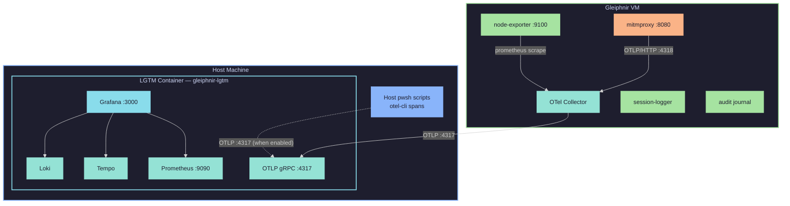
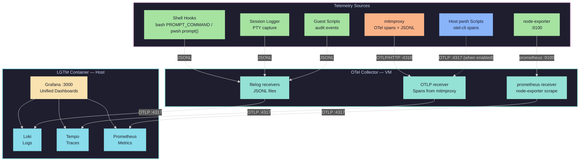

# Observability

Gleiphnir includes optional observability powered by the **Grafana LGTM stack** (Loki, Grafana, Tempo, Prometheus). When enabled, you get:

- **Agent audit journal** — every command executed in a sandbox is logged as structured JSONL (journalctl-style)
- **OTel traces** — HTTP calls from sandboxes generate proper OpenTelemetry spans (visible in Grafana Tempo)
- **HTTP traffic capture** — outbound HTTP/HTTPS requests are logged via a MITM proxy
- **Session input logging** — every command typed by sandbox users is captured
- **Secrets injection** — API keys and tokens are injected as env vars into sandboxes (ephemeral, no disk persistence)
- **System metrics** — CPU, RAM, disk, and network metrics from the VM via Prometheus node-exporter
- **User lifecycle auditing** — user add/remove events are logged
- **Grafana dashboards** — unified visualization of all signals at `localhost:3000`

## Architecture



The LGTM container runs as a **standalone Podman container on the host**, not inside the Gleiphnir VM. The VM ships telemetry to it over the network via `192.168.100.1:4317` (host gateway on `br-gleiphnir`).

## Quick Start

### 1. Enable observability

Edit `config/sandbox.env`:

```bash
OBSERVABILITY_ENABLED=true
```

### 2. Bring up the stack

```bash
mise run up
```

This will:
1. Start the VM as usual
2. Start the LGTM container on the host
3. Deploy observability agents (OTel Collector, node-exporter, mitmproxy) into the VM

### 3. Open Grafana

```bash
mise run obs:open
```

Or open `http://localhost:3000` manually (login: `admin` / `admin`).

## Configuration

All settings are in `config/sandbox.env`:

| Setting | Default | Description |
|---------|---------|-------------|
| `OBSERVABILITY_ENABLED` | `false` | Master toggle for the entire observability stack |
| `OBSERVABILITY_LGTM_IMAGE` | `grafana/otel-lgtm:latest` | Docker image for the LGTM container |
| `OBSERVABILITY_GRAFANA_PORT` | `3000` | Grafana UI port on the host |
| `OBSERVABILITY_OTLP_PORT` | `4317` | OTLP gRPC receiver port on the host |
| `OBSERVABILITY_PROM_PORT` | `9090` | Prometheus metrics port on the host |
| `OBSERVABILITY_PROXY_ENABLED` | `true` | Enable HTTP traffic capture via MITM proxy |
| `OBSERVABILITY_SESSION_LOGGING` | `true` | Enable session input (keystroke) logging |
| `SECRETS_ENABLED` | `false` | Enable secrets injection into sandbox containers |
| `SECRETS_AGE_PUBKEY` | *(empty)* | Age public key for encrypting secrets at rest |

## Mise Tasks

| Task | Description |
|------|-------------|
| `mise run obs:start` | Start LGTM container + deploy agents to VM |
| `mise run obs:stop` | Stop LGTM container |
| `mise run obs:status` | Show LGTM status and access info |
| `mise run obs:open` | Open Grafana dashboard in browser |
| `mise run obs:deploy` | Re-deploy agents to running VM |
| `mise run obs:clean` | Remove LGTM container and data volume |
| `mise run secrets:init` | Generate age keypair for secrets encryption |
| `mise run secrets:encrypt` | Encrypt config/secrets.env → config/secrets.env.enc |
| `mise run secrets:decrypt` | Decrypt config/secrets.env.enc → config/secrets.env |
| `mise run secrets:sync` | Copy secrets to VM over SSH |
| `mise run secrets:list` | Show configured secret names on the VM |
| `mise run secrets:status` | Show encryption/sync status |

## What Gets Captured

### Agent Audit Journal

Shell hooks in both bash and pwsh automatically log every command executed inside sandbox containers. Entries are written to `/var/log/sandbox/journal-<user>.jsonl`:

```json
{"timestamp":"2026-08-26T14:30:01.000000000Z","event":"command","user":"alice","session_id":"1724587200-1234","command":"git status","cwd":"/work","exit_code":0,"duration_ms":12}
{"timestamp":"2026-08-26T14:30:05.000000000Z","event":"command","user":"alice","session_id":"1724587200-1234","command":"git add .","cwd":"/work","exit_code":0,"duration_ms":8}
{"timestamp":"2026-08-26T14:30:10.000000000Z","event":"command","user":"alice","session_id":"1724587200-1234","command":"npm test","cwd":"/work","exit_code":1,"duration_ms":2340}
```

Query the journal inside a sandbox:

```bash
sandbox-journal                        # last 20 commands
sandbox-journal --last 50              # more entries
sandbox-journal --user alice           # filter by user
sandbox-journal --failed               # only failed commands
sandbox-journal --grep "git"           # search commands
sandbox-journal --since 1h             # last hour
sandbox-journal --follow               # tail new entries
sandbox-journal --json                 # raw JSON output
```

### OTel Traces (HTTP Spans)

The MITM proxy generates proper OpenTelemetry spans for every HTTP request from sandbox containers. Spans are exported to the OTel Collector via OTLP/HTTP and stored in Grafana Tempo.

**Agent trace context propagation:** If your agent sends a W3C `traceparent` header with HTTP requests, the proxy extracts the `traceId` and `parentSpanId` to create child spans:

```python
# Agent instruments its HTTP calls
import uuid
trace_id = uuid.uuid4().hex
span_id = uuid.uuid4().hex[:16]
headers = {"traceparent": f"00-{trace_id}-{span_id}-01"}
response = requests.get("https://api.example.com/data", headers=headers)
```

In Grafana Tempo, you see the full trace with HTTP call child spans including:
- `http.method`, `http.url`, `http.host`, `http.port`
- `http.response.status_code`, `http.response.size`
- `duration.ms` (latency breakdown)
- `net.peer.name`, `net.peer.port`

Each span also writes to `/var/log/sandbox/proxy-*.jsonl` as a JSONL fallback for Loki queries.

### Secrets Injection

Secrets are injected as environment variables into every sandbox container. They do NOT persist to disk (container rootfs is read-only).

**Setup:**

```bash
# 1. Create secrets file
cat > config/secrets.env << 'EOF'
GITHUB_TOKEN=ghp_xxxxxxxxxxxx
OPENAI_API_KEY=sk-xxxxxxxxxxxx
EOF

# 2. Generate age keypair (one-time)
mise run secrets:init

# 3. Encrypt (gitignore keeps plaintext out of version control)
mise run secrets:encrypt

# 4. Sync to VM
mise run secrets:sync
```

**How it works:**
- `config/secrets.env` is gitignored — never committed
- Encrypted at rest on the host with age (`config/secrets.env.enc`)
- On `secrets:sync`, the host decrypts locally and SCPs plaintext to the VM over SSH
- Stored on VM at `/var/lib/sandbox/secrets.env` (chmod 600, root-owned)
- On each SSH login, `sandbox-shell` reads the file and injects as `-e KEY=VALUE` flags
- Secrets are env vars inside the container — gone when the session ends

**Admin management on the VM:**

```bash
sudo sandbox-secrets list              # show key names (not values)
sudo sandbox-secrets set API_KEY=xxx   # add/update a secret
sudo sandbox-secrets remove API_KEY    # delete a secret
sudo sandbox-secrets rotate API_KEY    # generate random 32-char value
```

### Session Input (Keystrokes)

When `OBSERVABILITY_SESSION_LOGGING=true`, the `sandbox-shell` login wrapper uses a PTY logger to capture user input. Each session produces a JSONL file at `/var/log/sandbox/session-<user>-<id>.jsonl`:

```json
{"timestamp":"2026-08-25T12:00:00Z","event":"session_start","user":"alice","session_id":"1724587200-1234"}
{"timestamp":"2026-08-25T12:00:05Z","event":"input_line","content":"ls -la"}
{"timestamp":"2026-08-25T12:00:10Z","event":"input_line","content":"git status"}
{"timestamp":"2026-08-25T12:05:00Z","event":"session_end","user":"alice","session_id":"1724587200-1234","exit_code":0}
```

### HTTP Traffic

When `OBSERVABILITY_PROXY_ENABLED=true`, sandbox containers route outbound HTTP/HTTPS traffic through a mitmproxy instance running inside the VM. All requests are logged as JSONL:

```json
{"timestamp":"2026-08-25T12:00:15Z","event":"http_request","trace_id":"abc123...","method":"GET","url":"https://api.github.com/repos/...","host":"api.github.com","port":443,"scheme":"https","response_status":200,"response_size":1234,"duration_ms":150}
```

**Privacy note**: The MITM proxy decrypts HTTPS traffic for logging purposes. This data stays on your machine and is never sent externally. The proxy only runs inside the VM and only affects sandbox container traffic.

### System Metrics

Prometheus node-exporter runs inside the VM, scraping system metrics every 15 seconds:

- CPU usage (per-core)
- Memory usage
- Disk I/O and space
- Network traffic
- Filesystem metrics

The OTel Collector scrapes node-exporter and ships metrics to the LGTM container.

### User Lifecycle Events

The `sandbox-user` script logs add/remove events to `/var/log/sandbox/audit.jsonl`:

```json
{"timestamp":"2026-08-25T12:00:00Z","event":"user_add","user":"alice","admin":"admin","success":true}
{"timestamp":"2026-08-25T12:10:00Z","event":"user_remove","user":"alice","admin":"admin","success":true}
```

### Container Start Events

Each sandbox container emits a start event via `entrypoint.sh`:

```json
{"timestamp":"2026-08-25T12:00:00Z","event":"container_start","user":"dev","hostname":"sandbox","workspace":"/work"}
```

## Data Flow



## Resource Impact

| Component | Location | RAM | CPU | Disk |
|-----------|----------|-----|-----|------|
| LGTM container | Host | ~500 MB | Low idle | ~100 MB/day logs |
| node-exporter | VM | ~10 MB | Negligible | Negligible |
| OTel Collector | VM | ~50 MB | Low | Minimal |
| mitmproxy | VM | ~30 MB | Low | ~50 MB/day logs |
| **Total** | | **~590 MB** | **Minimal** | **~150 MB/day** |

The VM's 4GB RAM budget is barely affected (~90 MB). The host takes the brunt at ~500 MB for LGTM.

## Troubleshooting

### LGTM container won't start

```bash
# Check podman on host
podman ps -a | grep lgtm

# Check logs
podman logs gleiphnir-lgtm

# Force restart
mise run obs:stop
mise run obs:start
```

### No data in Grafana

1. Verify OTel Collector is running in the VM: `ssh admin@VM "systemctl status otelcol"`
2. Check OTel Collector logs: `ssh admin@VM "journalctl -u otelcol -f"`
3. Verify the LGTM endpoint is reachable from the VM: `ssh admin@VM "curl -s http://HOST_IP:4317"`
4. Check Grafana data sources: Open Grafana → Settings → Data Sources

### MITM proxy not capturing traffic

1. Check mitmproxy is running: `ssh admin@VM "systemctl status sandbox-proxy"`
2. Verify proxy port is open: `ssh admin@VM "ss -tlnp | grep 8080"`
3. Check that sandbox containers have proxy env vars: SSH into a sandbox, run `env | grep -i proxy`

### Agent journal not recording

1. Check that `/var/log/sandbox` exists inside the container: `ls -la /var/log/sandbox`
2. Verify hooks are active: `echo $PROMPT_COMMAND` (bash) or check profile.ps1
3. Look for journal files: `ls /var/log/sandbox/journal-*.jsonl`

### Secrets not injected

1. Check if secrets are deployed: `mise run secrets:list`
2. Verify marker file exists: `ssh admin@VM "ls -la /var/lib/sandbox/secrets-enabled"`
3. Re-sync: `mise run secrets:sync`

### High disk usage

Loki and Prometheus data accumulates over time. To clean up:

```bash
# Stop LGTM, remove data volume, restart
mise run obs:clean
mise run obs:start
```

## Mise Layering

The observability stack integrates with Gleiphnir's mise-based architecture:

- **`config/sandbox.env`**: All observability and secrets settings live here alongside VM/network/container config
- **`mise.toml`**: `obs:*` and `secrets:*` tasks provide lifecycle management
- **`vm/scripts/`**: PowerShell scripts handle host-side LGTM and VM-side agent deployment
- **`vm/guest/bin/`**: Bash scripts handle guest-side observability hooks and CLI tools
- **`vm/cloud-init/`**: Packages (node-exporter, mitmproxy) are installed at VM boot
- **`container/files/dotfiles/`**: Shell hooks (bashrc, profile.ps1) write journal entries
